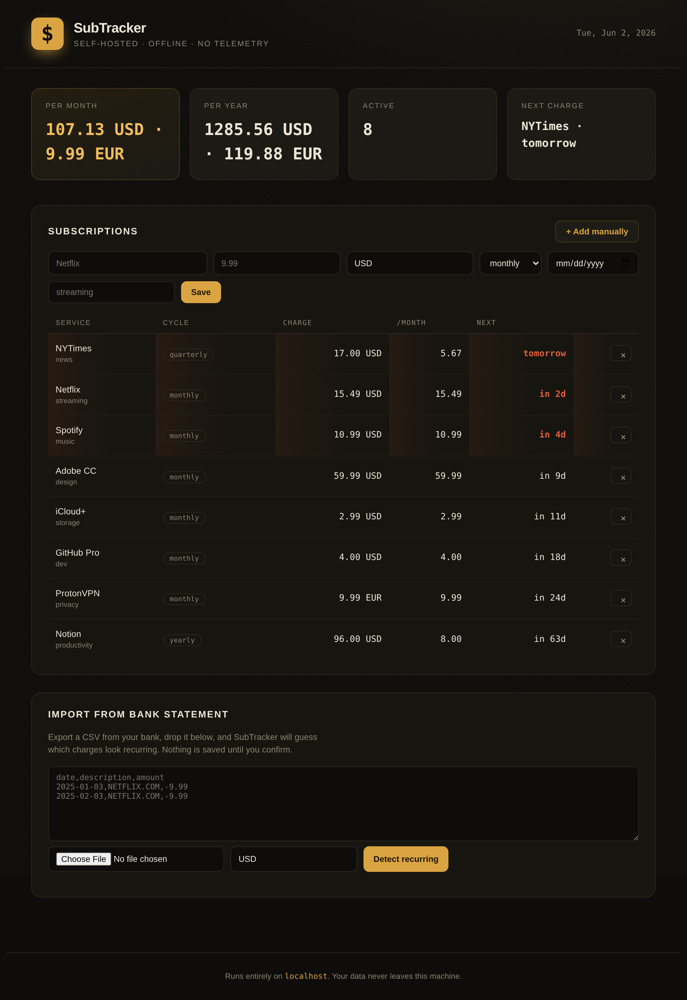

# SubTracker

**A self-hosted subscription tracker that runs entirely on your machine.**
Zero dependencies, zero telemetry, zero accounts. Just Python and your data.



Most subscription trackers are SaaS products that want your bank login and your
email address. SubTracker is the opposite: a single Python package with **no
third-party dependencies** that you run on `localhost`. Your financial data
never leaves the computer it's on.

---

## Why it's different

- **Detects subscriptions from a bank statement.** Export a CSV from your bank,
  paste it in, and SubTracker finds the charges that look recurring — grouping
  by merchant, checking that the amounts are stable and the gaps are regular,
  and scoring each guess with a confidence percentage. Nothing is saved until
  you confirm.
- **Honest multi-currency totals.** It never silently adds euros to dollars —
  totals are reported per currency.
- **Tells you what's about to hit.** Upcoming charges are surfaced and anything
  due within a few days is highlighted, so the "wait, *when* did that renew?"
  surprise goes away.
- **Truly offline.** No CDNs, no web fonts, no analytics. Open the dashboard
  with the network cable unplugged and it works exactly the same.

## Quick start

Requires **Python 3.10+**. That's the entire dependency list.

```bash
git clone https://github.com/<you>/subtracker.git
cd subtracker
python -m subtracker
```

Then open <http://127.0.0.1:8000>. Add a subscription manually, or scroll to
**Import from bank statement** and drop in a CSV.

Options:

```bash
python -m subtracker --host 0.0.0.0 --port 9000 --db ~/my-subs.db
```

## Importing a statement

SubTracker looks for a date column, a description/memo column, and an amount
column (names are matched flexibly and order doesn't matter). Outflows can be
negative or positive. A minimal example:

```csv
date,description,amount
2025-01-03,NETFLIX.COM 8829,-15.49
2025-02-03,NETFLIX.COM 1182,-15.49
2025-03-03,NETFLIX.COM 5567,-15.49
```

A sample statement lives in [`sample_data/statement_sample.csv`](sample_data/statement_sample.csv).
Detection handles both `1,234.56` and `1.234,56` number formats and several
common date layouts.

## How detection works

For each merchant the importer:

1. normalizes the noisy memo (`NETFLIX.COM 8829` → `netflix com`) so charges
   from the same vendor group together;
2. requires at least two occurrences;
3. checks the median gap between charges against known cycles (≈7d weekly,
   ≈30d monthly, ≈91d quarterly, ≈365d yearly);
4. penalizes unstable amounts and rewards more occurrences;
5. emits a confidence score so you can ignore the weak guesses.

One-off purchases (groceries, gas, a coffee) never reach the threshold and are
left out.

## Project layout

```
subtracker/
├── core.py       # Subscription model + all billing/date math (pure, tested)
├── store.py      # SQLite persistence
├── importer.py   # bank-statement CSV → recurring-charge detection
└── server.py     # zero-dependency http.server JSON API + static serving
web/              # the dashboard (vanilla HTML/CSS/JS, no build step)
tests/            # unit tests for the math and the detector
sample_data/      # an example bank statement to try the importer
```

## Tests

```bash
python -m unittest discover -s tests -v
```

## Roadmap

- Edit subscriptions in place and pause/resume without deleting
- Annual-vs-monthly "you'd save X by switching to yearly" hints
- Optional email/desktop reminder before a charge
- Export back to CSV / JSON

## License

MIT — see [LICENSE](LICENSE).
